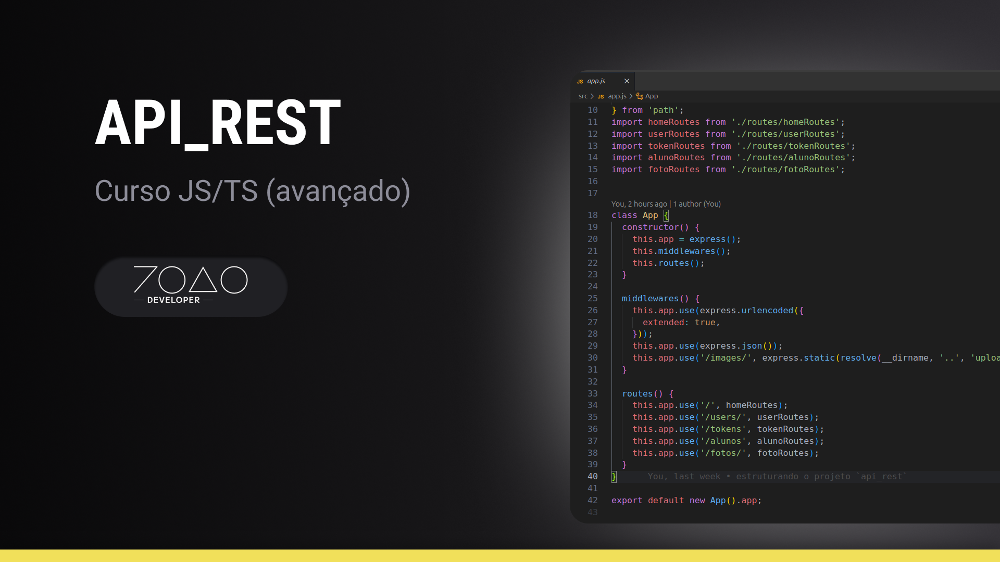

# API_REST (CRUD)
> CRUD feito no curso de javascript/typescript avançado

### Regras de métodos

---

- index -> Lista todos os usuários -> GET
- store/create -> Cria um novo usuário -> POST
- delete -> Apaga um usuário -> DELETE
- show -> Mostra um usuário -> GET
- update -> Atualiza um usuário -> PATH ou PUT
